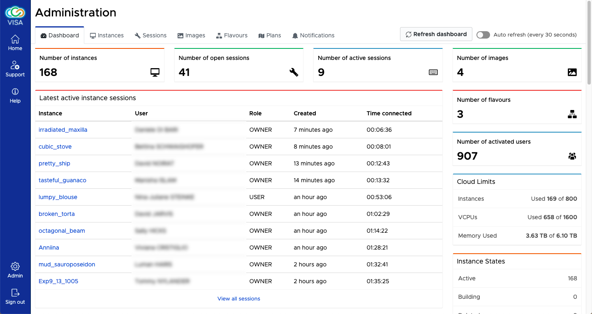

# Dashboard

The *Dashboard* admin UI provides a quick overview of the current usage of VISA.

The information included in the dashboard includes:

- **The number of instances**

  This is the number of instances of VISA that are active in OpenStack

- **The number of open Remote Desktop sessions**

  This gives an oveview of the usage of VISA during the day

- **The number of active Remote Desktop sessions**
  
  This takes into account the sessions where keyboard or mouse activity has been registered within the last 5 minutes

- **The number of Images in use**
- **The number of used Flavours**
- **The total number of users that have been active on VISA**

  This is recorded from the beginning of a VISA installationg to see how many users in total have used VISA
- **The cloud limits (maximum number of instances, vCPUs and memory)**

  These details are taken directly from the OpenStack API

- **A breakdown of instance states**

  This can show if a large number of instances are in *Error*

- **A list of latest Remote Desktop sessions**

  This gives an overview of which users are actively using VISA

- **A list of latest instances**

  This shows who has created the most recent instances

- **A list of latest connected users**

  This shows who (which instite) have been active lately on VISA

- **A breakdown of image usage**

  Shows a graphic of the distribution of images amongst the instances
- **A breakdown of flavour usage**

  This graphic shows which are the most popular flavours

By default the web page requires manual refresh (either reloading the full application or just the page using the *Refresh dashboard* button). The page can be automatically refreshed by setting the *Auto refresh* toggle button to active.

