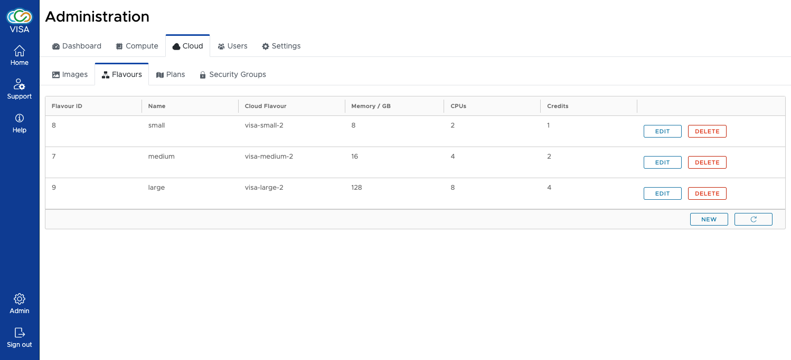

# Flavour management

Management of flavours is done using the Flavours admin page

The flavours interface shows a list of flavours that are available in VISA. The details of the Flavour includes:

- **ID** (automatically generated)
- **Name**

  The name of the image as shown in the instance creation page of VISA

- **Cloud flavour**

  The name of the Cloud flavour (associates the database flavour to a Flavour in OpenStack)

- **Memory**

  Shows the memory that is available with the Flavour (this is taken directly from OpenStack)

- **CPU**

  Shows the vCPUs that are available with the Flavour (this is taken directly from OpenStack)

The flavour can be updated and deleted. Please note that the database entry for the flavour is only soft deleted so it can be recovered if necessary. Deleting a flavour does not have any impact on running instances: this will only make the flavour invisible to users and no changes are made to OpenStack.

A button to create a new flavour is also available.

Both *update* and *create* UIs are the same

As shown in the image, details of the Flavour can be modified. Having selected a Cloud Flavour, the Memory and CPU are automatically updated.