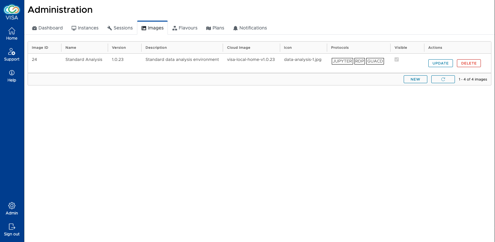
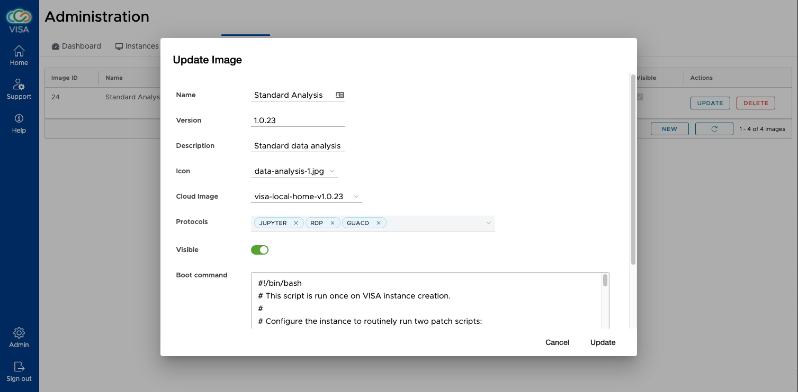

# Image management

To add, remove and modify images in VISA, the Image admin interface is available.

The images interface shows a list of images that are available in VISA. The details of the image includes:

- **ID** (automatically generated)
- **Name**

  The name of the image as shown in the instance creation page of VISA

- **Version**

  A manually entered version number

- **Description**

  A short description that is also shown to the user when they create an instance

- **Cloud image**

  The name of the Cloud image (associates the image to a VM image in OpenStack)

- **Icon**

  An icon to present to the users when creating an instance

- **Protocols**

  Associates different protocols to the instance to enable Remote Desktop and/or JupyterLab in the instance

- **Visible**

  A boolean value that allows an image to be only available to *admin* users. This is useful to test an image before it is publicly available.

The image can be updated and deleted. Please note that the database entry for the image is only soft deleted so it can be recovered if necessary. Deleting an image does not have any impact on running instances: this will only make the image invisible to users and no changes are made to OpenStack.

A button to create a new image is also available.

Both *update* and *create* UIs are the same

The details of the image can be entered and modified. 

A boot command can be associated to an image. The data stored in this field will be sent as `user_data` using *cloud-init* in the instance. This is particularly useful when wishing to perform a *per-instance* operation or making modifications to the instance without recreating a new image.

