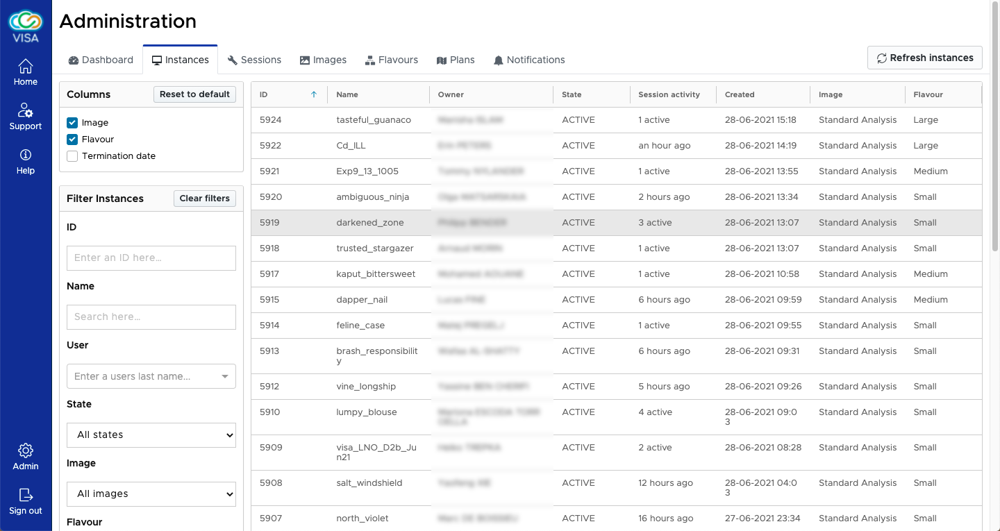
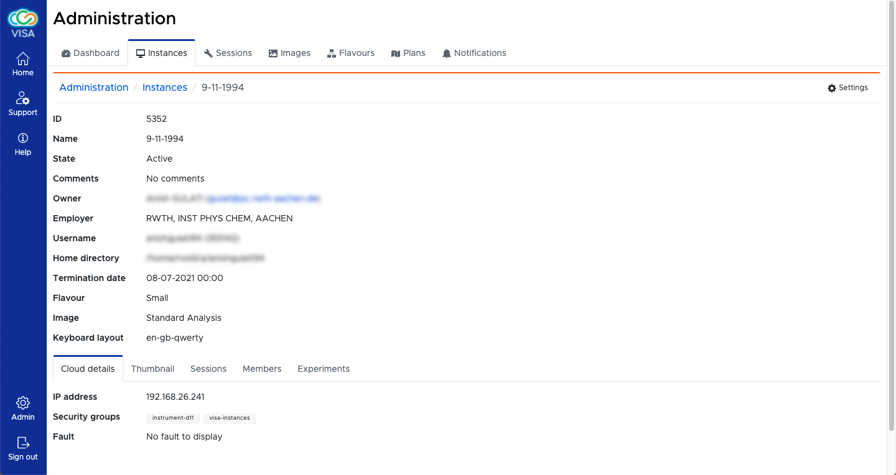

# Instances

The Instances admin interface allows an admin user to quickly search for an active instance.

The instances are ordered by default the most recent first. This can be changed to order by intance name by clicking on the *Name* column title.

On the left hand side some extra columns can be added to also show the Image, Flavour and Termination Date.

The filter boxes allows specific instances to be more easily found. Filtering can be done by

- Instance ID
- Instance name
- Instance user name (owner or shared member)
- The state of the instance
- Image
- Flavour
- Instrument (if the instance is associated to an experiment)

## Instance details

When clicking on any instance a details page is visible

The instance details allows an admin user to see attributes associated to an instance and find OpenStack details about the instance too such as its IP address and security groups.

The IP address is particularly useful when having to connect to a user's instance by SSH to performance maintenance or debugging.

Other details such as the session usage, members and experiments can be useful.
