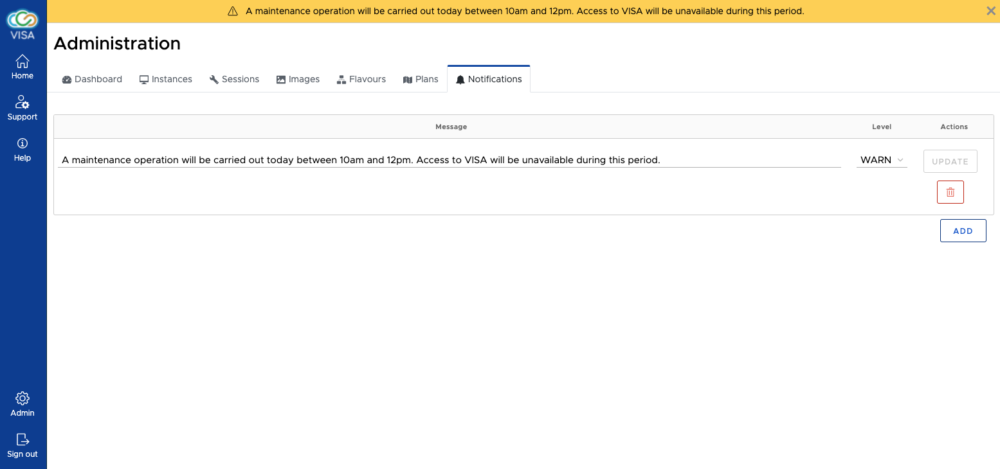

# Notifications

With VISA you can make notification messages visible to users. This is particularly useful when having to perform maintenance on the VISA platform which will cause some disruption to the availability of VISA.

The Notifications admin page allows notification message to be added and removed.

To create a notification, click on the *Add* button. You can then enter a message and a level. You must click on *Update* to make it active. Multiple messages can be active at the same time.

You can modify and delete notifications using the update and delete button too.

Users will see the message on their home page automatically. These messages can also be dismissed by pressing on the button on the right of the message.