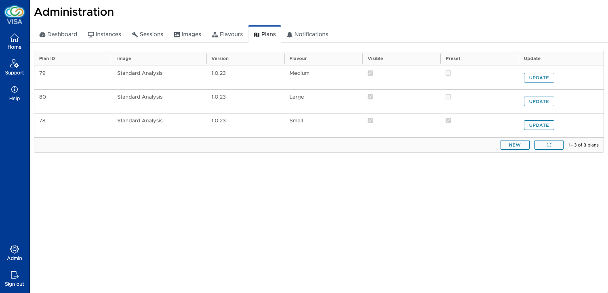
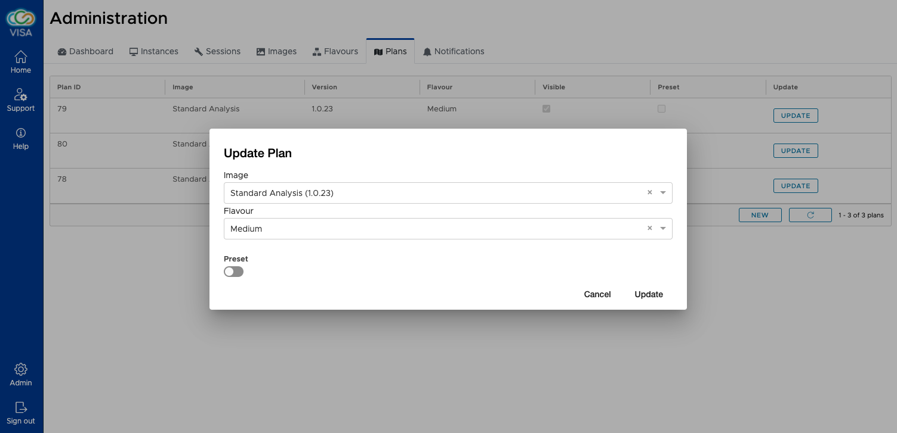

(admin_plan_management)=
# Plan management

A Plan represents the combination of an Image and a Flavour. This allows certain Images to be available for specific Flavours (for example if specific resources are necessary). 

Plans are proposed to users and the management of Plans is done using the Plan admin page.

The Plans interface shows a list of Plans that are available to users in VISA. The details of the Plan includes:

- **ID** (automatically generated)
- **Image**

  The name of the Image associated to the Plan

- **Version**

  The version of the Image associated to the Plan

- **Flavour**

  The name of the Flavour associated to the Plan

- **Visible**

  Specifies whether the Plan is visible (this is determined by whether the Image is visible or not)

- **Preset**

  Specifies whether the Plan is the pre-selected, default option for a user (only one Plan can be preset).

The Plan can be updated after being created. Please note that if an Image or a Flavour has been deleted, the Plan is also assumed to be deleted (and will not be visible in this interface or to users).

A button to create a new Plan is also available.

Both *update* and *create* UIs are the same

As shown in the image, the Image and Flavour associated to the Plan can be modified. You can also select whether to make the Plan the pre-selected one for users using the Preset toggle.