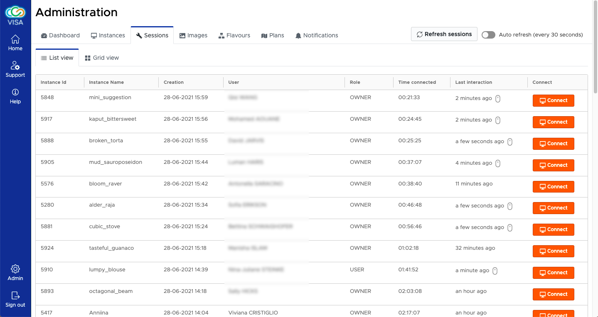

# Sessions

To monitor the active usage of VISA, the sessions admin page is available.

Here we see a list of all Remote Desktop sessions that are in use. We can also see how long a session has been open and when was the last time the user interacted with the Remote Desktop (mouse or keyboard event). Sessions that have been used within the last 5 minutes are shown with a *mouse* icon. 

Knowing when users are actively using a Remote Desktop is particularly useful when wishing to perform last-minute maintenant and redeploy VISA: by determining that no users are active (even though the sessions are open) allows for better analysis of whether to deploy a critical patch.

Remote Desktop sessions are not destroyed by redeploying VISA. At the worst the user will see a *disconnected* message. In most cases, the UI will detect that a new version of VISA has been deployed and will automatically reload the page.

Finally, a *Connect* button is available for all sessions: this allows the admin user to request access to the users' Remote Desktops; The user will receive a notification that access to their Remote Desktop has been requested and can accept or decline the request.

