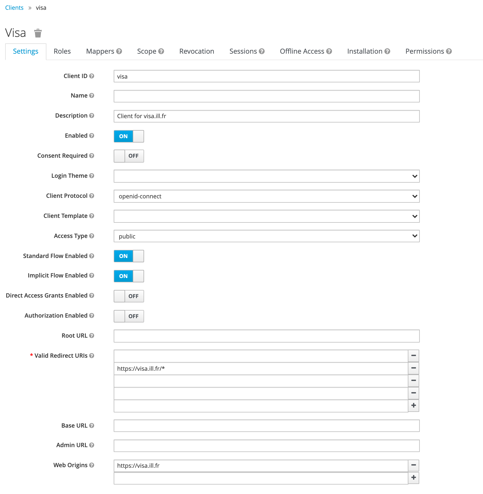

(deployment_authentication)=
# Authentication

VISA uses the OpenID Connect protocol to handle authentication. 

 Below, we give an example of how to setup an OpenID Connect client for VISA using Keycloak.

> You can use any authentication provider that supports OpenID Connect.

## Keycloak integration

### Configuring Keycloak OpenID Connect

Create a VISA client in Keycloak for your chosen realm.

1. Provide a client id: *visa*
2. Select the client protocol as *openid-connect*
3. Select the client access type as *public*
4. Standard Flow Enabled: On
5. Implicit Flow Enabled: On
6. Valid Redirect URL:  `https://{visa.server_address}/*`
7. Web origins: `https://{visa.server_address}`

#### Mappers

Keycloak allows you to map custom LDAP user attributes by clicking on *mappers* inside the client overview page. The attributes are sent as *claims* inside the *access token*.

The ILL's implementation of the Account Service attribute provider uses a mapper to get the unique ID of the connected use. This ID allows us to identify the roles as well as the proposals and experiments of the user. For more information about implementing the account-service, please go [here](development_accounts_service).

The following image shows the minimal configuration needed to setup Keycloak as an Identity Provider for VISA.

 

Please see [Accounts Service](development_accounts_service) documentation about how to configure your Account Service provider implementation to use the keycloak client that you have created.

