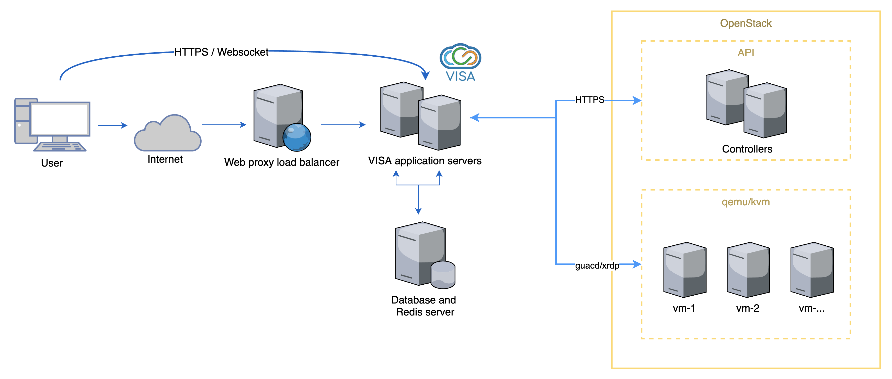

(deployment_load_balancing)= 
# Load balancing

The VISA platform has been developed to work in a load balanced environment. The main reason for load balancing is from the requirements of the remote desktop streaming of images when a lot of graphical changes occur on users' desktops.

## Design

Having a REST API (stateless), no design changes are required to main VISA backend, however the Remote Desktop web sockets required some additional changes to ensure messaging between shared connections functionned  correctly (users sharing a desktop are notified when new users join or leave the session for example).

### Redis

To allow for messaging between different VISA servers, a third-party messaging system is required. The Java implementation of `socket.io` in the backend (an implementation of [socket.io using Netty](https://github.com/mrniko/netty-socketio)) allows for a [Redis](https://redis.io/) client to be used to perform pub-sub messaging between the different servers. This requires a small amount of configuration of the server using the [remote desktop environment variables](deployment_environment_variables_vdi) (Redis database URL, ID and password).

In terms of deployment of VISA, Redis must be set up in the system. For practical usage, we generally recommend installing Redis on the same server as the database.

### System architecture

The following diagram shows the system architecture including a load balancer in front of the VISA application servers.

## Deployment

This section describes the load balancing implementation that is in production at the ILL. There are other ways of doing this, but this architecture is quite simple and has been easily adequate since coming in to production.

The load balanding is done principally by deploying the full VISA platform (VISA API Server, VISA Web, VISA Jupyter Proxy, VISA Accounts, VISA Security Groups and an NGINX reverse proxy) to two different hosts. We use the same `docker-compose.yml` and `deploy.sh` script outlined in the [docker deployment section](deployment_docker_compose) for both servers. Ideally, when using virtual machines, the different servers should be on different physical hosts.

### Configuration

The configuration [(environment variable file)](deployment_environment_variables) is almost identical however two variables must be modified: in essence we create a single primary node and one (or more) secondary nodes. 

The primary node is responsible for handling command execution to ensure only a single command at a time is run on a particular instance in OpenStack (for example *shutdown* or *restart* commands). 

Another configuration variable is required to do a cleanup task when the server starts: this must only be active in the primary node.

These two environment variables are

| Environment variable | Primary node value | Secondary node value |
|---|---|---|
| VISA_SCHEDULER_ENABLED |  true | false |
| VISA_VDI_CLEANUP_SESSIONS_ON_STARTUP |  true | false |

### NGINX Load Balancer

We use a simple [NGINX round-robin reverse proxy](http://nginx.org/en/docs/http/load_balancing.html) to manage load balancing of the two servers. This is installed on a separate server that acts as the main host for HTTP requests to VISA. The NGINX configuration simply alternates on each request between the configured servers.

A sample NGINX configuration for VISA can be <a href="../_static/files/visa-nginx-load-balancer.conf">downloaded here</a>.

