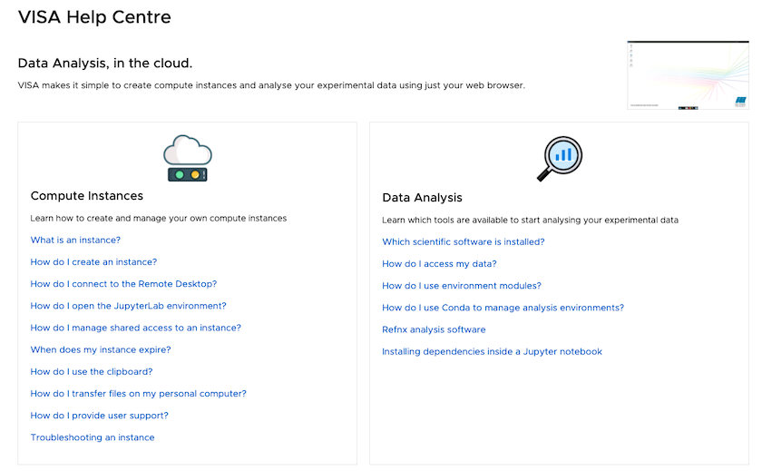

(deploying_user_documentation)=
# User documentation

VISA aims to provide comprehensive documentation to help users gets started with VISA and explain about the different features. The VISA documentation is readily available for the VISA Web UI.

To allow the documentation to be updated independently of the VISA application, the VISA documentation is maintained using a different GIT repository (using GIT also has the advantage of providing version control).

VISA Web UI will obtain the documentation from the host's `/api/docs` endpoint. Using NGINX, this endpoint can be redirected to a different location or reverse-proxied to another server. 

At the ILL the documentation is reverse-proxied directly to our local *gitlab* server. You can find an example of the NGINX configuration in the [`visa-deploy-scripts`](https://github.com/ILLGrenoble/visa-deploy-scripts/blob/4aa7f9c7d5e33b2b336096813b88f2ac09ca3faa/nginx/nginx.prod.conf#L70) project on GitHub.

An example of the format of the user documentation can be seen on the [VISA help pages](https://visa.ill.fr/help) at the ILL which is shown in the image below.




## GIT repository

The documentation for VISA at the ILL is available publicly on the [ILL *gitlab* repository](https://code.ill.fr/docs/visa-docs). The documentation is overall general about the usage of VISA although has some ILL-specific items (such as copying data, details of the availalbe data analysis software or about remote experiments using Nomad). 

We invite people to clone this repository and modify/add to the documentation accordingly for their installation.

## Documentation structure

The documentation is in Markdown and formatted directly by the VISA Web frontend. 

A *json* file (`sections.json`, located at the root of the project) contains the structure of the documentation: this file is important to tell VISA Web how to present the pages.

The example of the json is as follows:

```json
{
  "sections": [
    {
      "title": "Compute Instance",
      "icon": "assets/icons/instances.png",
      "path": "instances",
      "description": "Learn how to create and manage your own compute instances",
      "items": [
        {
          "title": "What is an instance?",
          "path": "about"
        },
        {
          "title": "How do I create an instance?",
          "path": "creating"
        },
        {
          "title": "How do I connect to the Remote Desktop?",
          "path": "connect-remote-desktop"
        },
        {
          "title": "How do I provide user support?",
          "path": "support",
          "roles": [
            "INSTRUMENT_CONTROL",
            "INSTRUMENT_RESPONSIBLE",
            "IT_SUPPORT"
          ]
        },
        {
          "title": "Troubleshooting an instance",
          "path": "troubleshooting"
        }
      ]
    }
  ]
}
```

### The *section* structure
Each *section* regroups documentation about a particular topic. The section structure is as follows:

|field|description|
|---|---|
|`title`| The title of the section|
|`icon`| An image file used as an icon for the section|
|`path`| The relative path to the document pages |
|`description`| A description of the section|
|`items`| An array of documentation pages|

### The *item* structure

The *item* element is composed as follows:

|field|description|
|---|---|
|`title`| The title of the documentation page|
|`path`| The path to the markdown file (only the prefix part as `.md` is appended)|
|`roles` (optional)| A list of roles for the users who can view this documentation. Please see [here](development_etl_user_data) for the possible roles.

### Role-based authorisation

As mentioned in the structure above, by specifying a list of `roles`, documentation can be restricted to different groups of people. 

This can be useful, for example, if providing additional information to support staff or to instrument scientists who may be working in parallel with external users on VISA.


