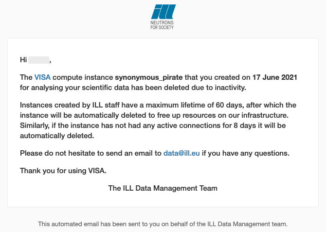

(development_emails)=
# Email customisation

VISA sends emails to users to notify them of changes to their instance. These occur when:

- An instance will be deleted due to inactivity
- An instance will be deleted when it reaches its maximum lifetime
- An instance has been deleted
- An instance lifetime has been extended (or an extension request has been refused)
- A user has been added to a shared instance

The emails contain information about the instance, the person and the facilty (eg contact details). 

Some emails are sent to the VISA administrators too including:
- When an instance has been created
- When a request has been made to extend the lifetime of an instance

To produce dynamic emails, a template is used with variable data added at specific places.

An example email sent from the ILL is shown below.

## Templating

The HTML for the emails are generated in the Java VISA API Server using the [Pebble](https://pebbletemplates.io/) template system (based on [Twig](https://twig.symfony.com/)) which provides [detailed documentation](https://pebbletemplates.io/wiki/guide/basic-usage/) on how to write templates. As stated on the Pebble website, *It features templates inheritance and easy-to-read syntax, ships with built-in autoescaping for security, and includes integrated support for internationalization*.

### Default template location

Default email templates can be found in the [VISA API Server project](https://github.com/ILLGrenoble/visa-api-server/tree/main/visa-business/src/main/resources/emails/templates). These templates are:

|File name|Description|
|---|---|
|`instance-deleted.twig`| Sent when an instance has been deleted |
|`instance-expiring.twig`| Sent when an instance will be deleted having not been used for several days |
|`instance-lifetime.twig`| Sent when an instance will be deleted having reached the end of its lifetime |
|`instance-extension.twig`| Sent when an instance lifetime has been extended (or when a request to extend the lifetime has been refused) |
|`instance-member-added.twig`| Sent when to a member when they have been added to a shared instance |
|`instance-extension-request.twig`| Sent to the admins when a user requests an extension to the lifetime of their instance |

Looking in the default location, you will see that there is another template file: `base.twig`. This is used to provide a common HTML container and common CSS for all the user-oriented emails so that they all have the same look and feel and same general information. There is also `base-admin.twig` which is used as a common base for emails sent to the VISA administrators.

### Customising the templates

These files can be re-written (and placed in a different location) to provide custom emails at each site. 

By modifying the [docker-compose deployment](deployment_docker_compose) to add a volume mount for the new template files and setting the `VISA_NOTIFICATION_EMAIL_ADAPTER_TEMPLATES_DIRECTORY` [environment variable](deployment_environment_variables_user_notification), VISA will take the templates from a custom location. Please note that the names of the template files must remain unchanged.

A limited number of variables are sent to the templates to render the HTML and is dependent on the email being sent. Below, we describe all the variables that can be used in each template.

#### Instance deleted (`instance-deleted.twig`)

The following variables are available for use in the *deleted* template:

|Variable|Java Type|Description|
|---|---|---|
|instance| [Instance](https://github.com/ILLGrenoble/visa-api-server/blob/main/visa-core/src/main/java/eu/ill/visa/core/domain/Instance.java) | The instance which will be deleted |
|user| [User](https://github.com/ILLGrenoble/visa-api-server/blob/main/visa-core/src/main/java/eu/ill/visa/core/domain/User.java) | The owner of the instance who is receiving the email|
|isStaff| Boolean | Specified whether the user is staff or not|
|maxInactivityDurationDays| Long | The maximum number of days the instance can be inactive before being deleted|
|maxLifetimeDurationDays| Long | The maximum lifetime of the instance in days|
|reachedMaxLifetime| Boolean | Specified whether the instance is being deleted because of inactivity or reaching max lifetime|
|rootUrl| String | The root URL of the VISA application|
|adminEmailAddress| String | The VISA Admin email address|

#### Instance expiring from inactivity (`instance-expiring.twig`)

The following variables are available for use in the *expiring* template:

|Variable|Java Type|Description|
|---|---|---|
|instance| [Instance](https://github.com/ILLGrenoble/visa-api-server/blob/main/visa-core/src/main/java/eu/ill/visa/core/domain/Instance.java) | The instance which will be deleted |
|user| [User](https://github.com/ILLGrenoble/visa-api-server/blob/main/visa-core/src/main/java/eu/ill/visa/core/domain/User.java) | The owner of the instance who is receiving the email|
|isStaff| Boolean | Specified whether the user is staff or not|
|maxInactivityDurationDays| Long | The maximum number of days the instance can be inactive before being deleted|
|maxLifetimeDurationDays| Long | The maximum lifetime of the instance in days|
|expirationDate| Date | The exact date and time when the instance will be deleted|
|rootUrl| String | The root URL of the VISA application|
|adminEmailAddress| String | The VISA Admin email address|

#### Instance lifetime extended (or extension request refused) (`instance-extension.twig`)

The following variables are available for use in the *extension* template:

|Variable|Java Type|Description|
|---|---|---|
|instance| [Instance](https://github.com/ILLGrenoble/visa-api-server/blob/main/visa-core/src/main/java/eu/ill/visa/core/domain/Instance.java) | The instance which will be deleted |
|handlerComments| String | The comments provided by the admin who handled the extension request |
|accepted| Boolean | Specified whether the instance lifetime has been extended or if the request was refused |
|user| [User](https://github.com/ILLGrenoble/visa-api-server/blob/main/visa-core/src/main/java/eu/ill/visa/core/domain/User.java) | The owner of the instance who is receiving the email|
|maxInactivityDurationDays| Long | The maximum number of days the instance can be inactive before being deleted|
|rootUrl| String | The root URL of the VISA application|
|adminEmailAddress| String | The VISA Admin email address|

#### Instance at the end of it's lifetime (`instance-lifetime.twig`)

The following variables are available for use in the *lifetime* template:

|Variable|Java Type|Description|
|---|---|---|
|instance| [Instance](https://github.com/ILLGrenoble/visa-api-server/blob/main/visa-core/src/main/java/eu/ill/visa/core/domain/Instance.java) | The instance which will be deleted |
|user| [User](https://github.com/ILLGrenoble/visa-api-server/blob/main/visa-core/src/main/java/eu/ill/visa/core/domain/User.java) | The owner of the instance who is receiving the email|
|isStaff| Boolean | Specified whether the user is staff or not|
|maxInactivityDurationDays| Long | The maximum number of days the instance can be inactive before being deleted|
|maxLifetimeDurationDays| Long | The maximum lifetime of the instance in days|
|rootUrl| String | The root URL of the VISA application|
|adminEmailAddress| String | The VISA Admin email address|

Please note that the date in which the instance will be deleted is part of the *Instance* model (`terminationDate`).

#### Instance member added (`instance-member-added.twig`)

The following variables are available for use in the *lifetime* template:

|Variable|Java Type|Description|
|---|---|---|
|instance| [Instance](https://github.com/ILLGrenoble/visa-api-server/blob/main/visa-core/src/main/java/eu/ill/visa/core/domain/Instance.java) | The instance which will be deleted |
|owner| [InstanceMember](https://github.com/ILLGrenoble/visa-api-server/blob/main/visa-core/src/main/java/eu/ill/visa/core/domain/InstanceMember.java) | The owner of the instance (who has added the member)|
|member| [InstanceMember](https://github.com/ILLGrenoble/visa-api-server/blob/main/visa-core/src/main/java/eu/ill/visa/core/domain/InstanceMember.java) | The member of the instance who is receiving the email|
|rootUrl| String | The root URL of the VISA application|
|adminEmailAddress| String | The VISA Admin email address|

#### Instance lifetime extension request (`instance-extension-request.twig`)

The following variables are available for use in the *lifetime* template:

|Variable|Java Type|Description|
|---|---|---|
|instance| [Instance](https://github.com/ILLGrenoble/visa-api-server/blob/main/visa-core/src/main/java/eu/ill/visa/core/domain/Instance.java) | The instance which will be deleted |
|owner| [InstanceMember](https://github.com/ILLGrenoble/visa-api-server/blob/main/visa-core/src/main/java/eu/ill/visa/core/domain/InstanceMember.java) | The owner of the instance (who made the request)|
|comments| String | The comments provided by the instance owner detailing why they would like the lifetime extended |
|rootUrl| String | The root URL of the VISA application|
