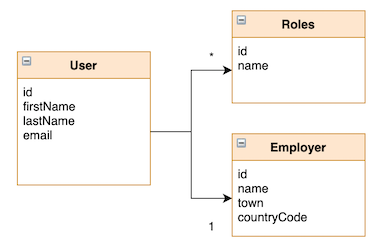
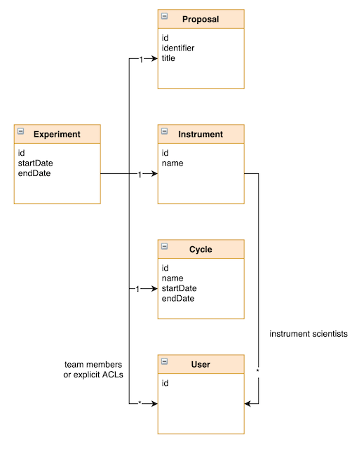

# Database Extraction, Transformation and Load (ETL)

## Description

**The Database Extraction, Transformation and Load (ETL) Process is a critical aspect of the VISA Common Portal being deployed at each site.**

VISA has a specific data structure concerning entities in the following two principal domains:

1. User data:  Users, roles and employers
2. Facility data: Proposals, experiments and instruments

The ETL process takes data from each site's data source (database or user system) and injects this into the VISA database in a specific format.

Each site needs to implement an ETL process for VISA to be deployed correctly. This process should run regularly (for example as a CRON job) to update VISA and include site data changes as soon as possible.

## Design

The ETL Process is an application that runs outside of the VISA server framework but has access to the VISA database.

A [Python VISA ETL Library](https://github.com/ILLGrenoble/visa-db-etl-py) is available to help sites develop an ETL process. This library perform the *load* part of the process and injects data into the VISA database. Each site must develop their own tools to extract data from their own systems and transform it correctly.

### Data Model

This section describes the model used by VISA where data has to come from the ETL process.

#### User Data

The following diagram illustrates the user data that should be loaded into VISA.

The ETL should import information about users. Most importantly here is the association of roles to users. VISA will work without any user data being injected but there will be no admin users or support users.

Different roles are associated to different users which can either be related to VISA itself or to the function of the person within the facility. These roles are pre-defined and experience has given us some insights into these and are important when providing support to users:

| Role                 | Type        | Description                                                                                                                                         |
|----------------------|-------------|-----------------------------------------------------------------------------------------------------------------------------------------------------|
| <null>               | application | A non-existant role implies that the user is a standard user with no special functionality                                                          |
| ADMIN                | application | Has full admin rights: can manage all instances, images, flavours, plans                                                                            |
| INSTRUMENT_CONTROL   | function    | Anyone who works for the instrument control service can provide support to users that are performing remote experiments                             |
| INSTRUMENT_SCIENTIST | function    | An instrument scientist (scientific staff at the facility) can provider support to anyone with an instance associated to their specific instruments |
| IT_SUPPORT           | function    | Any person from the IT service can provide support to the portal users                                                                              |
| SCIENTIFIC_COMPUTING | function    | A scientific computing specialist can provider support to users for the data analysis software                                                      |
| STAFF                | function    | All staff at the facility have different access rights to external users (for example for instance lifetimes or security groups)                    |
| STAKEHOLDER          | application | A stakeholder can obtain realtime figures on portal usage and long term statistical analysis of usage                                               |
|                      |             |                                                                                                                                                     |

#### Facility Data

The data model for the facility data is as follows.

Facility information (experiments, instruments, etc) is important to VISA when creating an instance and associating it to scientific data.

Associating an instance to facility data is important for:

- ensuring the data is accessible to the user
- ensuring the instance has correct security groups (allowing access to instrument control for example)
- allowing team access to share remote desktops
- providing scientific support to external users depending on the instrument
- statistical analysis

VISA has a simple model for this based around an Experiment. No team roles are included here (meaning that explicit users can also be associated to an experiment even if they weren't on the original team).

### Table Structure

