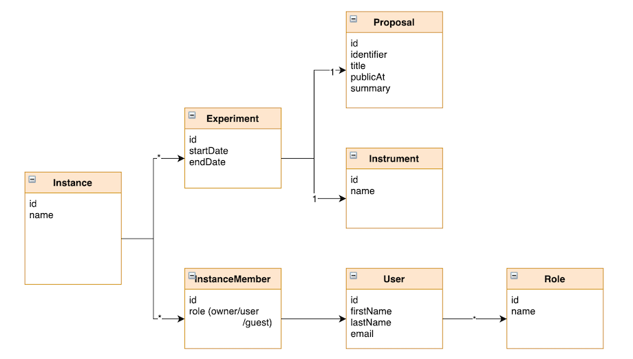

(development_security_groups)=
# Security Groups Service

## Description

This micro-service is used to manage the way OpenStack security groups (firewall rules) are selected for use for individual instances. This can be very site-specific so there needs to be a flexible way of adding logic to their selection.

For example, at the ILL, the security groups of an instance can depend on various parameters:

- user role (admin, staff, external user)
- associated experiments (and instruments)
- where an experiment is active
- Non-trivial logic is applied when determining the security groups which will be different for different sites.

Some rules can be made quite generic, for example if security groups depend on the role of the user: this can be configurable from site to site and so the logic is integrated directly into VISA API Server and configured via database entries.

However, to allow for customisations, the development and integration of a micro-service can be used to obtain a list of security group names.

## Design

The Security Group Service requires a single endpoint to get the security groups from given input data. It is called directly from the VISA API Server (if configured to do so).

There is no global design of how the security group service works as it is to be written from scratch by each site that has the need. However the input data remains the same: a model of the instance is sent to the service. The data model of the instance is shown below:



From the instance, the owner can be an important factor in determining the security groups as can the associated experiments. 

The data that is passed to this service can be modified for future versions if anything is missing for different sites.

The service must return a list of SecurityGroup objects that can be used by the VISA API Server when communicating with OpenStack. The structure of the SecurityGroup is very simple:

```javascript
interface SecurityGroup {
  id: number;
  name: string;
}
```

The name of this entity must be identical to the name given to the security group in OpenStack.

## API

This micro service has to implement a single endpoint:

| Method | Endpoint example          | Body | Returned Data   | Status Code | Description                            |
|--------|---------------------|------|-----------------|-------------|----------------------------------------|
| POST    | /api/securitygroups | Instance     | SecurityGroup[] | 200         | Returns a list of security group names |

The exact path of the endpoint can be defined by each site: VISA has a configuration value (for a full URL) where this can be set.

## Authorisation token

If you wish to a layer of security to your micro-service and ensure on specific clients can access it, you can check the value of the ```x-auth-token``` header parameter within the service.

VISA API Server can be configured to add this header parameter to each HTTP request made to the Security Group Service.

## Example project

To get started on writing a VISA Security Groups micro-service, an [example project](https://github.com/ILLGrenoble/visa-security-groups-example) is available. 

This project is not intended for use *as is* in a production environment but could be useful in the creation of a production service. The code includes a database adapter that can be configured to point to the [VISA database](deploying_database) and use the `security_group_filter` table.

This project can also be configured to use the authorisation token described above.

## Testing

To test the security group service a local version of the VISA API Server and VISA Web UI need to be run. The easiest way to do this is to use docker-compose to run the containerised version of VISA API Server and VISA Web and to use the following environment variables:
-  ```VISA_SECURITY_GROUP_SERVICE_CLIENT_ENABLED```: set to true to enable the use of a Security Group Service
-  ```VISA_SECURITY_GROUP_SERVICE_CLIENT_URL```: the URL of your local Security Group Service endpoint
-  ```VISA_SECURITY_GROUP_SERVICE_CLIENT_AUTH_TOKEN```: the value of the *auth token* (if required by your implementation) to ensure that no unauthorised use of the service is made

You can find more information about docker-compose in the [deploying](deployment_docker_compose) section.
