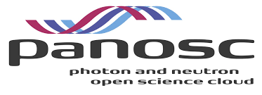

# VISA documentation

## Site contents

```{toctree}
---
maxdepth: 2
caption: VISA
---
overview/overview-contents.md
```

```{toctree}
---
maxdepth: 2
caption: Cloud infrastructure
---
openstack/openstack-contents.md
image/image-contents.md
```

```{toctree}
---
maxdepth: 2
caption: Installation
---
development/development-contents.md
deploying/deploying-contents.md
admin/admin-contents.md
```

```{toctree}
---
maxdepth: 2
caption: Source code
---
contributing/contributing-contents.md
```

## Acknowledgements

<p align="center">
  

  VISA has been developed as part of the Photon and Neutron Open Science Cloud (<a href="http://www.panosc.eu" target="_blank">PaNOSC</a>).
</p>


 PaNOSC has received funding from the European Union's Horizon 2020 research and innovation programme under grant agreement No 823852
